<h1 align="center"> Hangman ACF (Project3)</h1>

Hangman ACF or Animals, Countries and Foods, is a python terminal game. It will challenge your word knowledge in 3 different categories: Animals, Countries and Foods.
From 3 long lists of multiple different words depending on category, you will try and find the word regardless if it is a double or single word.

## Index - Table of Contents
* [How to play](#how-to-play)
* [List of features](#features)
* [UX/UI](#ux-ui)
* [Logic](#logic)
* [Testing](#testing)
* [Deployment](#deployment)
* [Citation of ALL sources](#citations)
* [Future features](#future-features)
* [Known Bugs](#know-bugs)

### HOW-TO-PLAY
Hangman AFC is based on the classic Hangman game which challanges the player to guess a correct letter and then the word before you are out of guesses.
You can read more about it here: [Wiki](https://en.wikipedia.org/wiki/Hangman_(game))  
The main menu allows for new game, print leaderboards and quit by writing 1, 2 or 3. 
For new game, you will input your Username and select one of the 3 categories. Then press enter when ready.
The game loop starts and you need to guess the correct letters or try your luck and writing the whole word.
No integers are allowed during guessing and if you guess the word, make sure your word is the same length!
You get points for correct guesses which get added to the final score once you find the word.
The final score depends on ammount of guesses and word length.
After the game, as long as your score is higher than 0, your score will be saved in leaderboards.
Accessing Leaderboards from the main menu will show the top 10 current scores and their usernames.

### FEATURES

- __Input-control:__  
- Validation check on all input requests except the Enter request.

- __Color coded text depending on type:__  
1. Blue for Welcome and goodbye message
2. Green for Variables and lists of used words.
3. Yellow for Leaderboard
4. White for user input request
5. Red for Error message

- __Main-Menu:__  
- New game, starts new game where you choose category.
- Leaderboards, shows current top 10.
- Exit game, asks you again if you want to quit and then exits the program.

- __Leaderboards:__  
- Saves all scores above 0 and usernames in external google spreadsheet.
- Takes spreadsheet, sort it and print top 10 when requested from main menu.

- __Game-Loop:__  
- Ask for category input and picks a random word from the list of said category.
- Asks for username
- Ask for "Enter" keypress to start game
- Displays Guessed words, guesses left and the hidden word with underscores.
- Ask for guesses and adds them to the guessed words list
- Once the hidden word is found, score is printed

### UX-UI

- __As-a-Creator-I-want:__
1. Easy to build but with challenging aspects
2. A fun and challeging game with enough features and words to keep it interesting

- __As-a-Visitor-I-want:__
1. Understand the controls and rules of the game
2. Get informative text when input is incorrect
3. See all guesses and guesses left to achieve highest possible score
4. To check leaderboards pre and post game.

- __As-a-Returning-User-I-want:__
1. To have a wide range of questions and categories.
2. Pull leaderboards and see the change as new high-scores are added.

### Logic
- Flowchart:  
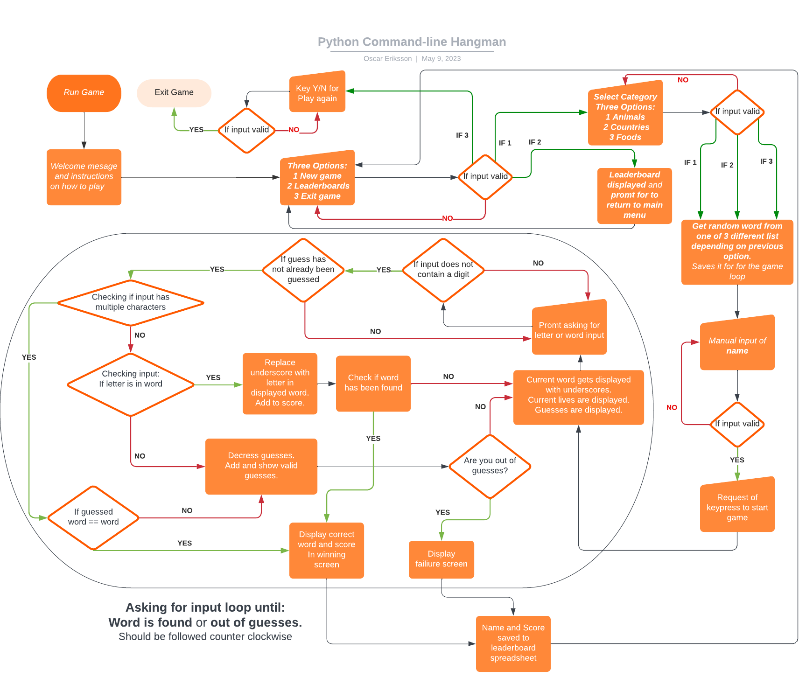

### TESTING

__Validator__

[Pep8 Online](https://pep8ci.herokuapp.com/#)
- run.py  
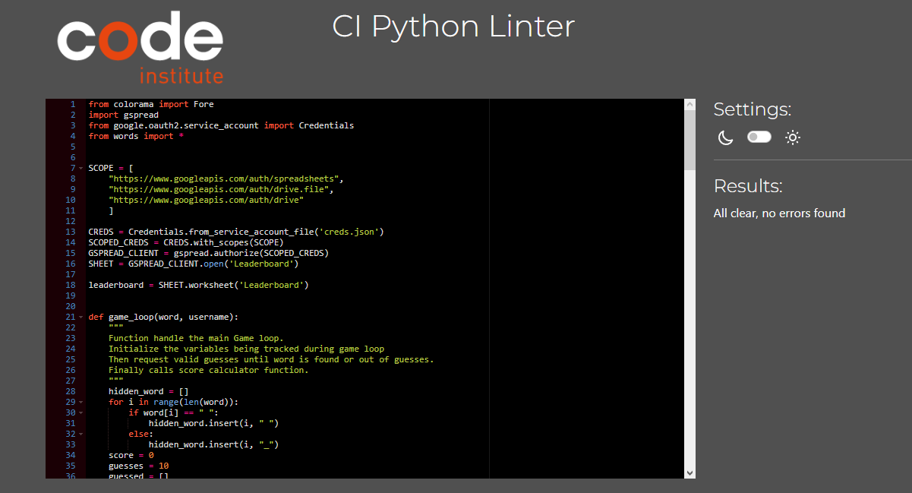
- words.py  
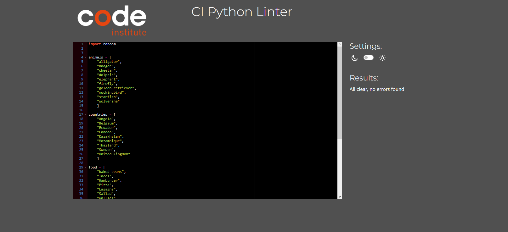
- Lighthouse results on desktop devices  
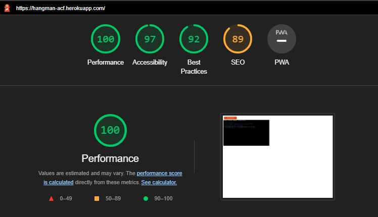

__Manual Testing__

- All input-checks are working as intended. Incorrect input throws red error text and a new request for input.
- Leaderboard is only showing the top 10 scores with indentation to display Names that are 20 characters long.
- Usernames has to be longer than 1 character and shorter than 20.  
- Main menu  
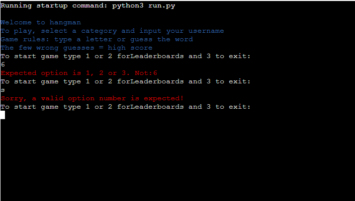  
- Leaderboards  
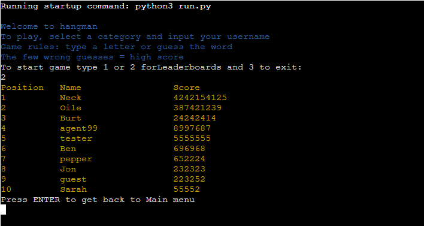  
- Quit game  
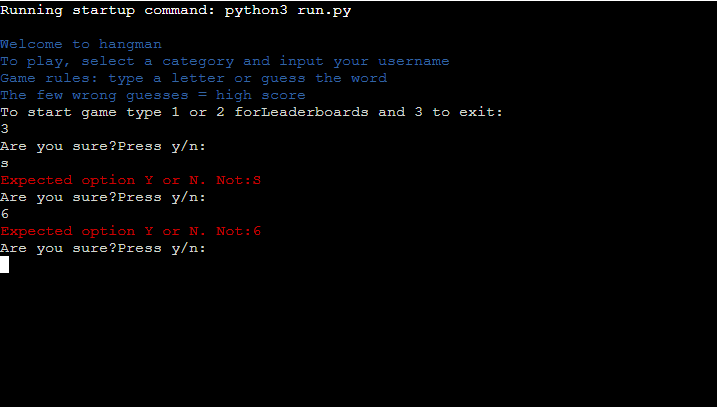  
- Categories  
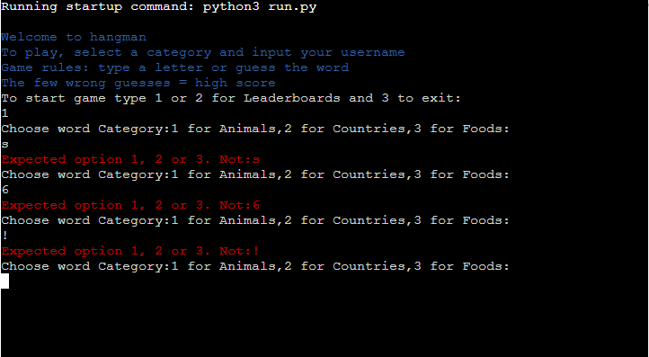  
- Username  
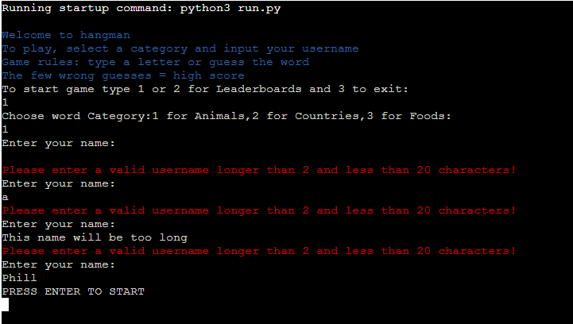  
- Game loop 1  
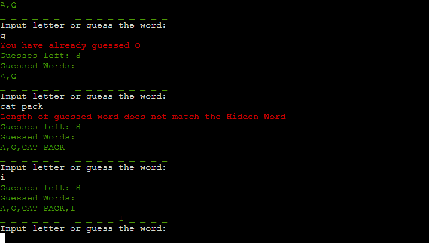  
- Game loop 2  
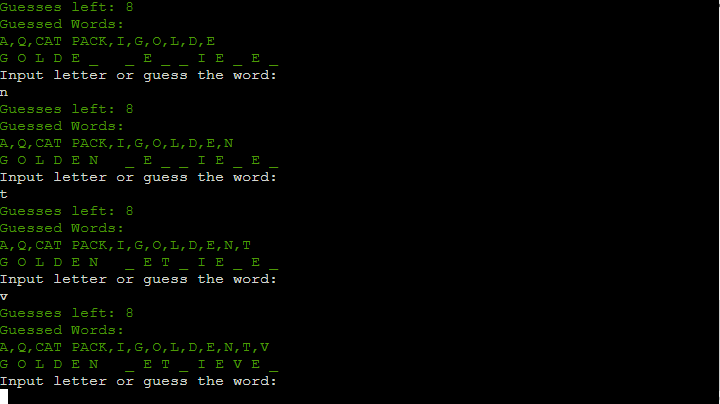  
- Win  
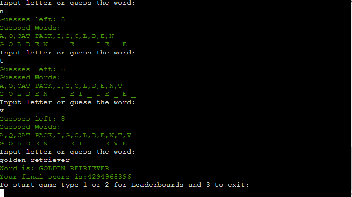  
- Goodbye message on exit  
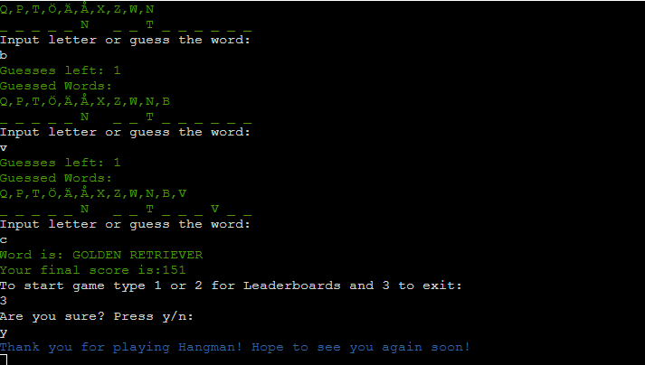  

__Bugs__
- During development that I dedicated extra time fixing:
- Input error handling for category
- Input and if logic during menu, to cover all cases
- Logic to cover multiword.

- Multiword causing game loop to fail
- Fix = Changed from checking ifAlpha to forloop checking if there is any digits in input.

- game crash when unexpected input on category
- Fix = added while loop and if statement looking for string of 1, 2 and 3 since this made it possible to catch errors if sending letter and wrong number.

__Browser Compatibility__

- Webpage is compatibal with Opera, Firefox and Chrome

### DEPLOYMENT

__This project was deployed using Code Institute´s mock terminal template to Heroku. The steps to deploy are as follows:__
1. Log into your Heroku account
2. Create a new app and follow the instructions
3. On your new app, click the Settings Tab and then the Config Vars button
4. In key write CREDS and in value paste everything in your projects creds file and click add
5. In Key write port and value 8000
6. In buildpack select python and save changes, then do the same but select node.JS.
7. Make sure Python is above Node.JS in the list.
8. Go to the Deploy tab of the app and select Github as method.
9. Confirm that you want to connect to Github.
10. Search for the repository of your project and at the bottom click Automatic or Manual deploy.

The live link can be found here - [Hangman ACF!](https://hangman-acf.herokuapp.com)

### CITATIONS

__Content__
- Content and layout was loosely based on Things to keep in mind PP3 Example Hangman by [PedroCristo](https://github.com/PedroCristo)

__Code__
- Base template repository for html + js and mockterminal take from: [Code Institute Python Essenstials Template](https://github.com/Code-Institute-Org/python-essentials-template)

- Initial layout of code, from main menu, game-loop to helper functions for leaderboards, score and external words file was taken from Things to keep in mind PP3 Example Hangman by [PedroCristo](https://github.com/PedroCristo)
- Idea of using colorama to color text based on its value taken from [PedroCristo](https://github.com/PedroCristo) and how to implement it from [Colorama](https://pypi.org/project/colorama/) 
- For loop for checking for digit in string take from [Stack Overflow](https://stackoverflow.com/questions/19859282/check-if-a-string-contains-a-number)
- Creating and adding the api for Gspread and code on how to use it taken from [Code Institute´s Love sandwiches](https://learn.codeinstitute.net/courses/course-v1:CodeInstitute+LS101+2021_T1/courseware/293ee9d8ff3542d3b877137ed81b9a5b/071036790a5642f9a6f004f9888b6a45/?child=first) 
- Python built in math for Pow used for score taken from [W3School python](https://www.w3schools.com/python/ref_func_pow.asp)
- Code on how to sort list based on list in list with lambda taken from [Java2blog](https://java2blog.com/python-sort-list-of-lists/)
- Nice printing of Leaderboard with f-string taken from [Delftstack](https://www.delftstack.com/howto/python/python-print-column-alignment/)
- Try except code guiding taken from [Code Instititue](https://learn.codeinstitute.net/courses/course-v1:CodeInstitute+CPP_06_20+2020_T1/courseware/e38bbf480aec434f9f00f0bf6285e35c/60c772e2068242b88b56998cd2023621/) and [W3School](https://www.w3schools.com/python/python_try_except.asp)
- Code for getting random Word from list taken from [PedroCristo](https://github.com/PedroCristo) and [GeeksforGeeks](https://www.geeksforgeeks.org/python-select-random-value-from-a-list/)

__Information Sources:__
- [Stack Overflow](https://www.stackoverflow.com)
- [W3School Python](https://www.w3schools.com/python/default.asp)
- [GeeksforGeeks](geeksforgeeks.org)
- [Code Institute, love-sandwiches](https://learn.codeinstitute.net/courses/course-v1:CodeInstitute+LS101+2021_T1/courseware/293ee9d8ff3542d3b877137ed81b9a5b/58d3e90f9a2043908c62f31e51c15deb/)
- [The Python Tutorial](https://docs.python.org/3/tutorial/)

### FUTURE-FEATURES
- More Categories and words
- More indepth Error except controls using custom exception classes
- Better design in print and added figure displayed depending on remaining guesses.

### KNOWN-BUGS
- Currently no specific input exception for all input requests.
- No other real bugs are known.
